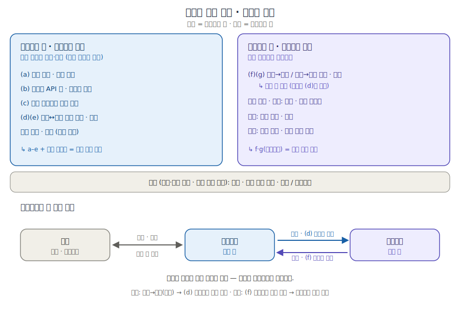

# Upbit Pocket Tester — 수동 검증 워크벤치

업비트 Open API를 **로컬 PC에서 사람이 직접 파라미터를 채워 호출하고**, 그 결과를
조회 API로 다시 불러와 **눈으로 대조**하기 위한 GUI 도구입니다. 자동매매/자동화가
아니라 *검증(workbench)* 이 목적입니다. 외부 배포 없이 본인 PC에서만 실행합니다.

> ⚠️ **업비트는 샌드박스가 없습니다.** 모든 호출은 실제 계정·실제 자산에 반영됩니다.
> 읽기 전용 모드 / Dry-run / 금액 상한 안전장치를 적극 활용하세요.

---

## 무엇을 할 수 있나

- **시세**(인증 불필요): 마켓 코드 · 현재가 · 호가 · 캔들 · 최근 체결
- **계좌**: 전체 계좌 조회 · 주문 가능 정보
- **주문**: 매수/매도(지정가·시장가) 생성, 리스트/개별 조회, 개별·일괄 취소
  → 생성/취소 직후 **주문 조회로 자동 대조**
- **외부 입금 검증**(메인포켓 키): 입금 주소 생성·조회, 입금 리스트/개별 조회, 원화 입금
- **외부 출금 검증**(메인포켓 키): 출금 가능 정보, 허용 주소 리스트, 디지털 자산/원화 출금
  → 출금 후 **출금 리스트로 대조**
- **포켓 자산 이전**: (a)~(g) 포켓 API. 활성 키 유형에 따라 메인(`universal_transfers`) /
  서브(`transfers`)로 **자동 분기**. from/to/uuid 는 `GET /v1/pockets` 캐시 **드롭다운**.

핵심 컨셉 — **호출 → 검증 짝짓기**: 모든 쓰기 액션은 호출 직후 대응 조회 API를 미리
채워 보여주고, 하단 **검증 체크리스트**(identifier 존재 / 금액·통화 일치 / 상태 done)를
사람이 체크하면 그 결과가 호출 로그에 함께 저장됩니다.

---

## 기술 스택

| 영역 | 스택 |
|---|---|
| 백엔드 | Python **FastAPI** + uvicorn. JWT 서명·query_hash·업비트 호출은 전부 백엔드. |
| 프론트 | **React (Vite) + Tailwind**. 좌측 탭 네비게이션 단일 페이지. |
| 저장소 | **SQLite**. API Key 메타(secret는 암호화), 요청 프리셋, 호출 로그. |

`secret_key` 는 **프론트로 절대 내려가지 않습니다.** 백엔드에서 Fernet(키는 `APP_SECRET`
파생)로 암호화 저장하고, 서명 시점에만 메모리에서 복호화합니다. 프론트는 항상 `key_id`
만 보내고 서명은 백엔드 단일 프록시(`POST /api/proxy`)가 수행합니다.

---

## 폴더 구조

```
upbit-pocket-tester/
├── backend/
│   ├── requirements.txt
│   └── app/
│       ├── config.py    # .env 로딩
│       ├── crypto.py    # secret_key 암호화
│       ├── db.py        # SQLite 스키마 + DAL
│       ├── upbit.py     # JWT 서명 + query_hash(SHA512) + httpx 호출
│       └── main.py      # FastAPI: keys/settings/presets/logs/proxy
├── frontend/
│   └── src/
│       ├── endpoints.js # ★ 전 API 카탈로그(메서드/경로/필드/권한/검증짝)
│       ├── store.js api.js App.jsx
│       ├── components/  # Banner KeyBar Sidebar JsonView ReqRespViewer
│       │                # ConfirmModal VerifyChecklist EndpointRunner
│       └── tabs/        # Keys Category History Settings
├── .env.example  .gitignore
├── start.ps1  start.sh  README.md
```

---

## 실행 (한 번에 띄우기)

전제: **Python 3.10+**, **Node.js 18+** 설치.

### Windows (PowerShell)
```powershell
cd C:\Users\<you>\Desktop\upbit-pocket-tester
copy .env.example .env      # 그리고 .env 의 APP_SECRET 를 긴 무작위 문자열로 변경
powershell -ExecutionPolicy Bypass -File .\start.ps1
```
첫 실행 시 백엔드 venv 생성 + 의존성 설치 + 프론트 `npm install` 후, 두 개의 창
(uvicorn, vite)이 열립니다.

### macOS / Linux / Git-Bash
```bash
cp .env.example .env        # APP_SECRET 변경
chmod +x start.sh && ./start.sh
```

### 접속
- 프론트엔드: <http://localhost:5173>
- 백엔드 헬스체크: <http://127.0.0.1:8000/api/health>

### 수동 실행(스크립트 없이)
```bash
# 1) 백엔드
cd backend
python -m venv .venv
.venv\Scripts\activate            # (mac/linux: source .venv/bin/activate)
pip install -r requirements.txt
uvicorn app.main:app --host 127.0.0.1 --port 8000 --reload

# 2) 프론트엔드 (새 터미널)
cd frontend
npm install
npm run dev
```

---

## 사용 순서

1. **키 관리** 탭에서 API Key 등록 — 라벨, access/secret, 포켓 유형(메인/서브),
   부여 권한 체크리스트. 상단 **활성 키 셀렉터**로 전환.
2. 활성 키의 **유형·권한에 따라 불가 탭/버튼은 비활성화**되고 사유가 툴팁으로 표시됩니다.
   (서브포켓 키 → 외부 입출금/포켓관리 비활성)
3. 각 API: 파라미터 폼 → 호출 → **요청/응답을 나란히** 보는 접이식 뷰어(복사 버튼).
   쓰기 액션은 **확인 모달**에서 요청 바디를 재확인 후 전송.
4. 쓰기 직후 나타나는 **검증 패널**에서 조회 API를 실행하고 **체크리스트**로 대조 → 저장.
5. **히스토리** 탭에서 시간순 조회·검색·재실행(응답코드/지연/Remaining-Req 표시).

---

## 포켓 권한 한눈에

메인포켓 키(포켓관리)와 서브포켓 키(자산이전)의 차이, 서브포켓에 돈을 넣고 빼는 흐름을 한 장으로:



- **메인포켓 키 · 포켓관리**: (a~c) 포켓 목록·API키·다른 서브 잔고 조회 / (d)(e) 메인↔서브 이전·내역 / 외부 입금·출금 — 모두 메인 전용.
- **서브포켓 키 · 자산이전**: (f)(g) 서브→메인·서브→서브 이전·내역(서브 전용). 자기 잔고·주문은 계좌·주문 탭에서. 외부 입출금·포켓 관리·다른 포켓 조회는 불가.
- **넣기**: 외부→메인(입금) → (d) 메인키로 메인→서브 이전. **빼기**: (f) 서브키로 서브→메인 이전 → 메인키로 외부 출금. (서브는 외부와 직접 입출금 불가, 항상 메인을 거침.)

앱에서도 좌측 **도움말 · 포켓 권한** 탭에서 같은 가이드를 볼 수 있습니다.

---

## 안전장치

- 상단 **실거래 경고 배너** 상시 표시.
- 쓰기 액션(주문 생성/취소·출금·이전) **확인 모달 + 요청 바디 재확인**.
- **읽기 전용 모드**(GET 외 차단) / **Dry-run**(서명된 요청만 표시, 전송 안 함) 전역 토글.
  → 백엔드에서도 강제되어 프론트 우회 불가.
- **금액 상한**(주문 KRW / 원화 출금 / 코인 출금 / 이전 수량). 초과 시 차단. (설정 탭)
- `identifier` 1회용 자동 생성(1~64자, 영숫자 `_ . -`), 이전/주문 로그에 보관.
- amount/balance 는 부동소수 대신 **문자열(decimal)** 로 처리.
- 포켓 이전 내역 조회는 `start_time~end_time` **최대 7일**(초과 시 차단), ISO 8601 또는 ms(UTC).

### 레이트리밋
Exchange 기본 그룹은 계정 단위로 **초당 약 30회를 공유**합니다. 각 호출 응답의
`Remaining-Req` 헤더가 화면과 로그에 표시됩니다.

---

## API 스펙 / 경로에 대한 메모

엔드포인트는 클래식 업비트 REST 표면(`https://api.upbit.com/v1/...`, 언더스코어 표기,
예: `/v1/withdraws`, `/v1/pockets/universal_transfers`)을 기준으로 구현했습니다.
포켓 관련 (a)~(g) 스펙은 요청서에 명시된 경로·파라미터·권한을 그대로 반영했습니다.

모든 호출은 **전체 요청 URL을 화면에 그대로 표시**하며, `UPBIT_BASE_URL`(.env)과
각 엔드포인트 경로(`frontend/src/endpoints.js`)는 한 곳에 모여 있어, 업비트 문서가
바뀌어도 경로 한 줄만 고치면 됩니다.

참고 문서: <https://docs.upbit.com/kr/reference> · <https://docs.upbit.com/llms.txt>
